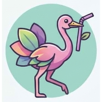

<p align="center">
  
</p>

<h1 align="center">OrchyStraw</h1>

<p align="center">
  <strong>Drop-in multi-agent prompt system for AI coding agents.</strong><br/>
  Proven across 15+ dev cycles. 441 files, 1877 tests, 0 blockers.
</p>

<p align="center">
  
  
  
</p>

```
Your project
├── prompts/
│   ├── 00-shared-context/    ← every agent reads this
│   ├── 01-pm/                ← PM writes to all agent files
│   ├── 02-backend-dev/       ← standing orders, not chat
│   ├── 03-frontend-dev/
│   ├── 04-design-system/
│   ├── 05-qa/
│   └── 99-me/                ← things YOU do manually
├── scripts/
│   ├── agents.conf           ← who runs, what model, what order
│   └── auto-agent.sh         ← one command, full cycle
└── CLAUDE.md                 ← project rules for all agents
```

## What This Is

A **prompt scaffold** — not a framework, not a library, not another `pip install`. Just markdown files and a shell script that orchestrate multiple AI coding agents (Claude Code, Windsurf, Codex, Cursor, or anything with a CLI).

Born from building a production app where this system ran 15+ autonomous dev cycles, producing 441 source files, 1877 tests, and 2 QA reports with zero blockers. No babysitting.

## Why Not CrewAI / MetaGPT / AutoGen?

| | CrewAI | MetaGPT | AutoGen | **orchystraw** |
|---|---|---|---|---|
| Install | `pip install crewai` | `pip install metagpt` | `pip install autogen` | `cp -r template/ your-project/` |
| Dependencies | Python, LangChain, etc. | Python, many deps | Python, many deps | **Zero. Markdown + bash.** |
| Runs with | Own runtime | Own runtime | Own runtime | **Any AI agent CLI** |
| Config | Python code | Python code | Python/JSON | **Markdown files** |
| Learning curve | Hours | Hours | Hours | **10 minutes** |
| Works with Claude Code | Adapter needed | No | No | **Native** |
| Works with Windsurf | No | No | No | **Native** |
| Works with Cursor | No | No | No | **Native** |
| Battle-tested | Enterprise pilots | Academic | Research | **15+ production cycles** |

**The difference:** Those are frameworks that run agents inside their runtime. orchystraw is a **file-based protocol** that works with whatever agent you already use. No vendor lock-in. No runtime. No dependencies.

## How It Works

### 1. Copy the template
```bash
cp -r orchystraw/template/ your-project/
```

### 2. Run the bootstrap prompt
```bash
cd your-project
claude --print "$(cat orchystraw/bootstrap-prompt.txt)"
# or paste into Windsurf / Cursor / Codex
```

The bootstrap reads your codebase, asks zero questions, and generates:
- `CLAUDE.md` (project rules)
- `scripts/agents.conf` (agent roster)
- `prompts/01-pm/` (PM prompt tailored to your project)
- `prompts/02-*/` through `05-*/` (dev agents based on your stack)
- `prompts/00-shared-context/context.md` (the shared brain)

### 3. Run a cycle
```bash
./scripts/auto-agent.sh
```

This runs each agent in order: PM plans → devs build → QA reviews → PM updates.

Or run agents manually:
```bash
claude --print < prompts/02-backend-dev/02-backend-dev.txt
```

### 4. PM writes standing orders

The PM doesn't "chat" with devs. It writes **standing orders** — updates to each agent's prompt file that tell them exactly what to build next cycle. This is not LLM-to-LLM conversation. It's structured, async delegation via files.

```
PM writes to prompts/02-backend-dev/02-backend-dev.txt:
  "Cycle 4 objectives: Add user auth (JWT), create /api/sessions endpoint,
   write 5 integration tests. Read: docs/AUTH-SPEC.md"

Backend dev reads that file, executes, writes results to shared-context.
PM reads shared-context, updates all agent prompts for cycle 5.
```

## The Shared Context Pattern

Every agent reads `prompts/00-shared-context/context.md` before starting and appends to it before finishing. This is the **single source of truth** across all agents.

```markdown
# Shared Context — [Project Name]

## Architecture Decisions
- [CTO decided X because Y — date]

## Current State
- Backend: 12 endpoints, all tested
- Frontend: 8 pages, 3 need QA
- Blockers: None

## Last Cycle Summary
- Backend dev: Added auth endpoints (3 files, 5 tests)
- Frontend dev: Built settings page (2 components)
- QA: Found 1 regression in /api/users, filed issue #47
```

No vector databases. No RAG. No embeddings. Just a markdown file that every agent reads and writes. It works because context is bounded and relevant.

## Numbering Convention

```
00-*  → Shared (context, backups, session tracking)
01-*  → PM (coordinator, writes to all other prompts)
02-*  → First dev agent
03-*  → Second dev agent
...
98-*  → Last possible agent
99-*  → You (the human — manual actions, reviews)
```

`00` and `99` are reserved. Everything between is agents, ordered by seniority.

## Agent Design Principles

From 15+ cycles of trial and error (full guide: [AGENT-DESIGN.md](./AGENT-DESIGN.md)):

1. **One agent, one domain.** Backend dev doesn't touch frontend. QA doesn't fix bugs.
2. **Objectives are specific.** Not "improve the app" — "Add 3 endpoints, write 5 tests, update shared-context."
3. **Every prompt has: Role, Context, What Exists, Objectives, Rules, Done Criteria.**
4. **"DO NOT CHANGE" sections** prevent agents from rewriting architecture decisions.
5. **Cycle numbers in filenames** (`cycle-04-backend.txt`) prevent agents from confusing old and new context.

## What You Get

```
orchystraw/
├── README.md                           ← you're here
├── AGENT-DESIGN.md                     ← how to write good agent prompts
├── WORKFLOW.md                         ← full cycle lifecycle reference
├── ARCHITECTURE.md                     ← system architecture overview
├── TROUBLESHOOTING.md                  ← common failure modes + fixes
├── bootstrap-prompt.txt                ← one prompt to scaffold any project
├── template/                           ← copy this into your project
│   ├── CLAUDE.md
│   ├── prompts/
│   │   ├── 00-shared-context/
│   │   ├── 00-session-tracker/
│   │   ├── 00-backup/
│   │   ├── 01-pm/
│   │   └── 99-me/
│   └── scripts/
│       ├── agents.conf.example
│       ├── auto-agent.sh
│       └── check-usage.sh
└── examples/
    ├── sample-agents.conf              ← example agent configuration
    └── sample-pm-prompt.txt            ← example PM prompt
```

## Real Results

From production use (15+ cycles):

| Metric | Before | After orchystraw |
|--------|---------------|---------------|
| Files per cycle | 5-10 | 30-50 |
| Tests written | Manual | 1877 automated |
| Blockers per cycle | 1-3 | 0 |
| Human intervention | Every 30 min | Once per cycle (review) |
| QA reports | None | 2 comprehensive reports |
| Agent confusion | Frequent | Rare (bounded context) |

## FAQ

**Q: Does this work with [my AI agent]?**  
If it has a CLI or accepts a text prompt, yes. Claude Code, Windsurf, Cursor, Codex, Aider, Continue, OpenClaw — anything.

**Q: Why not just use CrewAI?**  
CrewAI is a Python framework with its own runtime. orchystraw is markdown files. You copy a folder and you're done. No dependencies, no lock-in, works with whatever agent you already use.

**Q: How is this different from just writing good prompts?**  
orchystraw is a *system*, not individual prompts. The PM-writes-to-agent-files pattern, the shared context protocol, the cycle lifecycle, the numbering convention — these are coordination mechanisms that prevent the chaos that happens when you just throw prompts at multiple agents.

**Q: What if I only use one agent?**  
orchystraw still helps — the shared context file, the CLAUDE.md, and the cycle structure keep a single agent focused across sessions. But the real power comes from 2+ agents.

## Docs

### Getting Started
- **[Concepts](docs/CONCEPTS.md)** — what every piece is, why it exists, how they work together
- **[Creating Custom Agents](docs/CREATING-CUSTOM-AGENTS.md)** — add new agents, ownership rules, design patterns
- **[CLI Guide](docs/CLI-GUIDE.md)** — which CLI to use per agent role, cost optimization, multi-CLI setup

### Usage Guides
- **[Claude Code](docs/USAGE-CLAUDE-CODE.md)** — full setup, flags, model selection, tips from 15+ cycles
- **[Windsurf](docs/USAGE-WINDSURF.md)** — Cascade integration, Flows, hybrid setup
- **[Cursor / Codex / Others](docs/USAGE-CURSOR-CODEX.md)** — Cursor, Codex, Aider, any CLI agent

### Reference
- **[Agent Design Guide](AGENT-DESIGN.md)** — how to write prompts that actually work
- **[Workflow Reference](WORKFLOW.md)** — full cycle lifecycle, git ops, safety
- **[Architecture](ARCHITECTURE.md)** — system architecture overview
- **[Troubleshooting](TROUBLESHOOTING.md)** — common failures and fixes

## License

MIT — use it however you want.

## Credits

Built by [CS](https://github.com/ChetanSarda99). Battle-tested on production apps.

Inspired by the multi-agent orchestration patterns emerging in the Claude Code, Windsurf, and AI coding communities.
