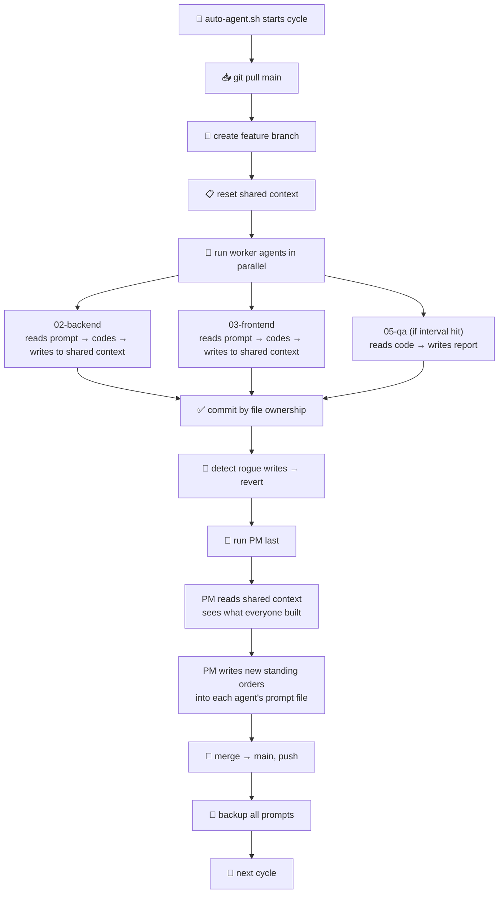

<p align="center">
  
</p>

<h1 align="center">OrchyStraw</h1>

<p align="center">
  <strong>A simple way to get multiple AI agents working together on the same project.</strong><br/>
  Claude Code, Codex, Gemini CLI, Aider, Windsurf, Cursor — anything that takes a prompt.
</p>

<p align="center">
  
  
</p>

---

## What is this?

If you've ever tried to get two AI agents working on the same codebase, you know the mess — they overwrite each other's files, lose context between sessions, and forget what they were doing.

OrchyStraw fixes that. It's a set of markdown files and one bash script. No framework to install, no Python package, no runtime. You copy a folder into your project and you're up and running.

It keeps agents in their lanes, gives them a shared memory, and has one agent (the PM) coordinate the whole thing.

---

## How a cycle looks



---

## How it actually works

There are three pieces: **prompts**, **a script**, and **shared context**.

### Prompts — each agent's skill file

Every agent gets its own markdown file. Think of it as a job description — not a chat message, but a complete set of instructions the agent reads fresh every cycle.

```
prompts/
├── 00-shared-context/         ← the team's shared memory
├── 01-pm/                     ← the coordinator
│   └── 01-project-manager.txt
├── 02-backend/                ← backend agent
│   └── 02-backend-dev.txt
├── 03-frontend/               ← frontend agent
│   └── 03-frontend-dev.txt
├── 05-qa/                     ← QA reviewer
│   └── 05-qa-review.txt
└── 99-me/                     ← stuff only you can do
    └── 99-actions.txt
```

A prompt looks like this:

```markdown
# [Project] Backend Developer

**Your Role:** Backend Developer — APIs, database, auth, tests
**Objective:** [what to build this cycle]

## Context
[What the project is, tech stack, where things stand]

## YOUR TASKS (This Cycle)
1. Add POST /api/users endpoint with validation
2. Write 5 integration tests for the auth flow
3. Update shared-context with what you built

## Rules
- Only touch files in: backend/ prisma/
- Don't touch: frontend/ ios/ prompts/
- Read shared-context before you start
- Write what you did to shared-context when you're done
```

Why not just chat with agents? Because chat drifts. Instructions get buried ten messages deep and agents start hallucinating old context. A fresh prompt every cycle means the agent always knows exactly what to do.

### The script — runs everything

`auto-agent.sh` handles the full cycle so you don't have to babysit:

```bash
./scripts/auto-agent.sh orchestrate     # run 10 cycles
./scripts/auto-agent.sh orchestrate 5   # run 5 cycles
./scripts/auto-agent.sh run 02-backend  # run one agent
./scripts/auto-agent.sh list            # see who's registered
```

The script handles git, file ownership, backups, and rogue detection. Agents just focus on code.

### Shared context — how agents stay in sync

There's one file every agent reads before starting and writes to before finishing:

`prompts/00-shared-context/context.md`

```markdown
## Backend
- Added POST /api/users (3 files, 5 tests)
- NEED: Frontend to build the user creation form

## Frontend
- Built login page and signup form
- BLOCKED: Waiting on /api/auth/refresh from backend
```

No vector databases, no RAG pipelines, no embeddings. Just a markdown file agents read and append to.

### The PM — the brain of the operation

The PM agent is what makes multi-agent actually work. It:

- Runs **last**, after all the workers are done
- Reads shared context to see what everyone built
- Writes new instructions directly into each agent's prompt file for the next cycle
- Keeps a running record in the session tracker
- Drops anything it can't handle into `99-me/` for you

Agents never talk to each other. Everything goes through PM via the shared context file. It's a hub, not a mesh.

### Agent configuration

`scripts/agents.conf` is where you define your team:

```bash
# id | prompt_path | ownership | interval | label
01-pm      | prompts/01-pm/01-pm.txt       | prompts/ docs/    | 0 | PM
02-backend | prompts/02-backend/02-be.txt   | backend/ prisma/  | 1 | Backend
03-frontend| prompts/03-front/03-fe.txt     | frontend/ src/    | 1 | Frontend
05-qa      | prompts/05-qa/05-qa.txt        | none              | 5 | QA
```

- **ownership** = what directories this agent can write to. `none` means read-only.
- **interval** = `1` means every cycle. `5` means every 5th. `0` means coordinator (runs last).

---

## The skills stack

Each agent prompt can tap into multiple skill layers. Mix and match depending on the agent's role.

### Layer 1: Built-in slash commands
Every Claude Code agent gets these for free — no setup needed:

| Command | What it does |
|---------|-------------|
| `/test` | Run or generate tests for the current code |
| `/review` | Multi-pass code review (bugs, security, perf, readability) |
| `/security` | OWASP Top 10 security audit |
| `/debug` | Structured debugging with hypothesis testing |
| `/refactor` | Improve structure without changing behavior |

Backend agents get all five. Design agents might only need `/review`. QA agents lean on `/security`, `/review`, and `/debug`.

### Layer 2: Superpowers plugin
Optional but powerful. Install via Claude Code marketplace:

| Skill | Best for |
|-------|----------|
| `brainstorming` | PM — refine ideas into design docs |
| `writing-plans` | All agents — break work into 2-5 min tasks |
| `test-driven-development` | Backend — RED→GREEN→REFACTOR enforcement |
| `subagent-driven-development` | Backend, Frontend — dispatch sub-agents per task |
| `systematic-debugging` | QA, Backend — hypothesis-driven root cause tracing |
| `verification-before-completion` | All — verify everything works before marking done |

### Layer 3: Sub-agent teams
For bigger tasks, agents can spawn their own sub-agents:

| Team pattern | When to use |
|-------------|-------------|
| `team-implementer` | Parallel feature builds with file ownership |
| `team-lead` | Decompose and coordinate complex tasks |
| `team-reviewer` | Parallel multi-dimension review (security, a11y, perf) |
| `team-debugger` | Hypothesis-driven parallel debugging |

### Layer 4: MCP servers
Configured in `.mcp.json`. The template includes context7 by default for framework docs. Add Supabase, QMD (local search), or whatever your project needs.

### Layer 5: CLAUDE.md
Your project-wide rules file. Design system, code standards, anti-slop rules. Every agent reads it automatically.

Include a skills block like this in every agent prompt:

```markdown
## Skills & Working Style
**Skills:** /test after new logic, /review after features, /security before auth code
**Superpowers:** test-driven-development, verification-before-completion, writing-plans
**When building:** Read existing code first. Follow established patterns. Append to 99-me if blocked.
```

---

## Getting started

### 1. Copy the template into your project

```bash
cp -r orchystraw/template/ your-project/
```

### 2. Run the bootstrap prompt

This looks at your codebase and generates all the agent files automatically:

```bash
cd your-project

# Use whatever agent you have:
claude --print "$(cat orchystraw/bootstrap-prompt.txt)"         # Claude Code
codex --approval-mode full-auto -q "$(cat orchystraw/bootstrap-prompt.txt)"  # OpenAI Codex
gemini "$(cat orchystraw/bootstrap-prompt.txt)"                 # Gemini CLI
aider --message "$(cat orchystraw/bootstrap-prompt.txt)"        # Aider
# Or just paste the prompt into ChatGPT, Windsurf, Cursor — anything
```

You'll get `agents.conf`, `CLAUDE.md`, and prompt files tailored to your project's stack.

### 3. Let it run

```bash
./scripts/auto-agent.sh orchestrate
```

Or run a single agent to test:

```bash
# Any of these work:
claude --print < prompts/02-backend/02-backend-dev.txt
codex --approval-mode full-auto -q < prompts/02-backend/02-backend-dev.txt
gemini < prompts/02-backend/02-backend-dev.txt
```

---

## Things that will bite you (and how to avoid them)

Lessons from running multi-agent setups across real projects.

| Problem | What happens | Fix |
|---------|-------------|-----|
| Agents writing outside their lane | Backend agent edits the orchestrator script | Explicit ownership in `agents.conf` + rogue write detection reverts it |
| Agents running git commands | Agent does `git checkout -b feature` and derails the cycle | Add "DO NOT run git commands" to every prompt's auto-cycle block |
| PM writing code | PM "helps" by implementing a small fix instead of delegating | PM prompt says "you NEVER write code" — enforce it |
| Stale task lists | Prompt says "build X" but X shipped two cycles ago | PM must acknowledge completed work and remove done tasks each cycle |
| Two agents owning the same directory | iOS dev and Design agent both edit `ios/Components/` | Use exclusion paths: `ios/ !ios/Components/` vs `ios/Components/` |
| No shared context | Agents duplicate work or build conflicting APIs | Every agent reads and appends to `00-shared-context/context.md` |
| Referencing fake commands | Prompt says `/plan`, `/deploy`, `/lint` — these don't exist | Only 5 built-ins (`/test`, `/review`, `/security`, `/debug`, `/refactor`) |
| Agent updates its own prompt | Self-modifying chaos | "Do NOT update your own prompt — PM handles that" |
| No escalation path | Agent silently fails on something it can't do | 99-me protocol — append blockers to `prompts/99-me/99-actions.txt` |

---

## Why this approach instead of a framework

There are a lot of multi-agent frameworks out there — CrewAI, MetaGPT, AutoGen, LangGraph. They're all Python packages with their own runtimes, their own abstractions, their own learning curves.

OrchyStraw takes a different approach: **agents coordinate through files, not through a framework.**

The insight is that AI agents already read and write markdown really well. So instead of building a message bus or an agent runtime, you just give each agent a markdown file with instructions, a shared context file for coordination, and a bash script to handle the git and file management that agents are bad at.

This means:
- **No vendor lock-in** — switch from Claude to Codex to Gemini without changing anything
- **No runtime to maintain** — it's a folder of text files
- **No learning curve** — if you can read markdown, you understand the whole system
- **Agents handle the hard part (code), the script handles the boring part (git)**

The tradeoff is that you don't get real-time agent-to-agent communication. But in practice, that mostly generates noise anyway. Research from Google DeepMind (["Towards a Science of Scaling Agent Systems"](https://arxiv.org/abs/2503.XXXXX)) shows that naively adding agents multiplies errors — hierarchical coordination (like OrchyStraw's PM pattern) outperforms flat agent meshes.

---

## Agent numbering

```
00-*  → Reserved: shared context, backups, session tracker
01-*  → PM (coordinator — runs last)
02-09 → Core dev agents
10-49 → Specialists (design, docs, security, i18n)
50-98 → Room to grow
99-*  → Reserved: you (manual tasks)
```

---

## FAQ

**Can I use different AI models for different agents?**
Yes. That's the point. Use your best model (Opus, GPT-4o) for PM and QA where reasoning matters, and something faster/cheaper (Sonnet, GPT-4o-mini, Gemini Flash) for dev agents doing routine coding. Each agent is just a prompt file — feed it to whatever CLI you want.

**How many agents should I start with?**
Three or four. PM + 2 dev agents + QA is the sweet spot. Adding more agents before you have clear domain boundaries just adds confusion. Scale up when you genuinely have non-overlapping work.

**What if an agent does something unexpected?**
The script catches rogue writes (files outside ownership) and reverts them. PM reviews all work at the end of each cycle. And you've got 7 days of prompt backups. If something really goes sideways, there's a nuclear reset command in [Troubleshooting](TROUBLESHOOTING.md).

**Does this work on Windows?**
It's a bash script, so you need WSL, Git Bash, or similar. The template includes Windows toast notifications for cycle completion if you're on WSL.

**Can agents spawn sub-agents?**
Yes — the skills stack supports sub-agent teams (`team-implementer`, `team-reviewer`, etc.). An agent can break a big task into parallel sub-agents that each own specific files. This is separate from the orchestrator-level agents.

**Why does the PM run last?**
Because PM needs to see what everyone built before planning the next cycle. If PM ran first, it would be planning based on stale information. Running last means PM reads the shared context (which all workers just updated), reviews the git diff, and writes informed standing orders.

**What about long-running projects?**
The session tracker (`00-session-tracker/SESSION_TRACKER.txt`) is the permanent record across all cycles. PM updates it every cycle with what shipped, milestone progress, and decisions made. The shared context file resets each cycle, but the session tracker accumulates.

**Can I run this without the script?**
Yes. The script automates the cycle, but you can run any agent manually: `claude --print < prompts/02-backend/02-backend-dev.txt`. Useful for testing a new agent before adding it to the automated cycle.

**Is there a cost tracking feature?**
The template includes `check-usage.sh` which monitors API rate limits and writes to `usage.txt`. The orchestrator pauses when usage gets too high. For detailed cost tracking per agent, check your provider's dashboard.

---

## Repo structure

```
orchystraw/
├── README.md
├── CONTRIBUTING.md              ← how to contribute
├── CHANGELOG.md                 ← version history
├── AGENT-DESIGN.md              ← writing good agent prompts
├── WORKFLOW.md                  ← how a cycle works end to end
├── ARCHITECTURE.md              ← system overview
├── TROUBLESHOOTING.md           ← when things go wrong
├── bootstrap-prompt.txt         ← one prompt to set up any project
├── assets/branding/             ← logo + icons
├── .github/
│   └── ISSUE_TEMPLATE/          ← bug reports, feature requests, config sharing
├── template/                    ← copy this into your project
│   ├── CLAUDE.md
│   ├── prompts/
│   │   ├── 00-shared-context/
│   │   ├── 00-session-tracker/
│   │   ├── 00-backup/
│   │   ├── 01-pm/
│   │   └── 99-me/
│   └── scripts/
│       ├── agents.conf.example
│       ├── auto-agent.sh
│       └── check-usage.sh
├── examples/
│   ├── sample-agents.conf
│   └── sample-pm-prompt.txt
└── docs/
    ├── CONCEPTS.md
    ├── CREATING-CUSTOM-AGENTS.md
    ├── USAGE-CLAUDE-CODE.md
    ├── USAGE-WINDSURF.md
    └── USAGE-CURSOR-CODEX.md
```

---

## Docs

- **[Concepts](docs/CONCEPTS.md)** — every piece explained in detail
- **[Creating Custom Agents](docs/CREATING-CUSTOM-AGENTS.md)** — adding agents, ownership rules, patterns
- **[Agent Design](AGENT-DESIGN.md)** — writing prompts that actually work
- **[Workflow](WORKFLOW.md)** — cycle lifecycle and git operations
- **[Architecture](ARCHITECTURE.md)** — system architecture
- **[Troubleshooting](TROUBLESHOOTING.md)** — common issues and fixes
- **[Claude Code](docs/USAGE-CLAUDE-CODE.md)** — setup and flags
- **[Windsurf](docs/USAGE-WINDSURF.md)** — Cascade integration
- **[Cursor / Codex / Others](docs/USAGE-CURSOR-CODEX.md)** — other CLIs and editors
- **[Contributing](CONTRIBUTING.md)** — how to help
- **[Changelog](CHANGELOG.md)** — version history

---

## License

[MIT](LICENSE)

---

Built by [CS](https://github.com/ChetanSarda99).
