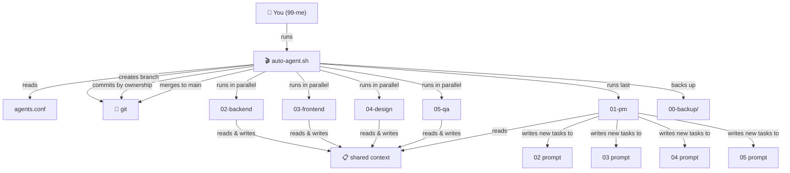
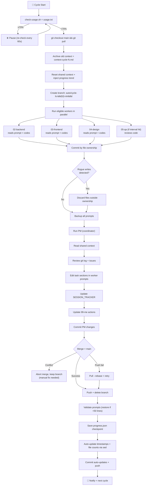
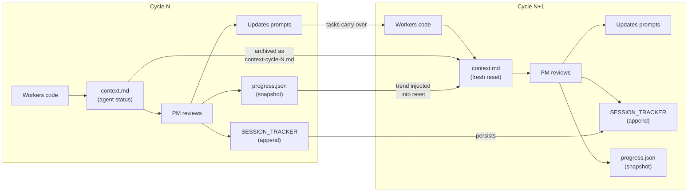
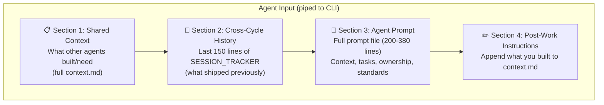
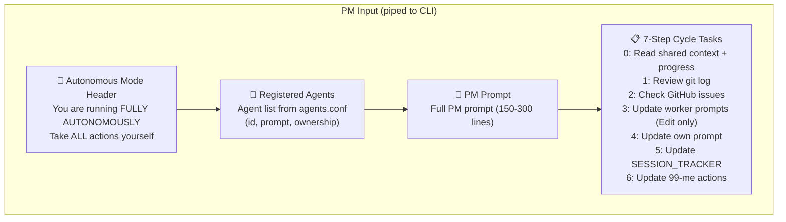
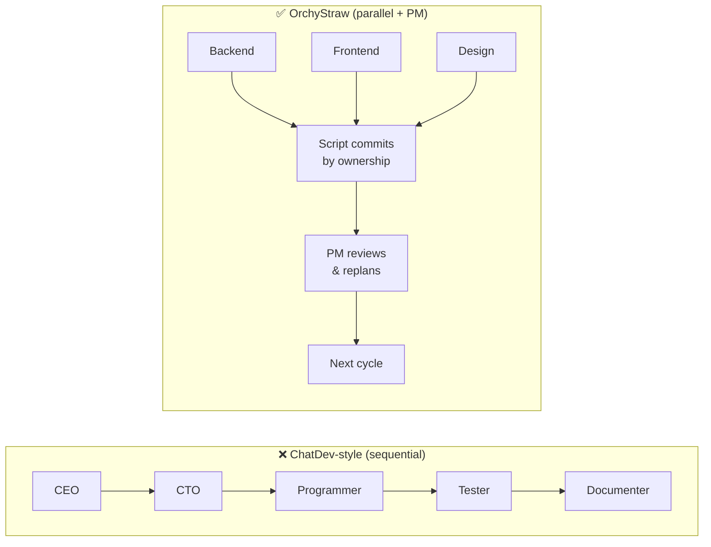
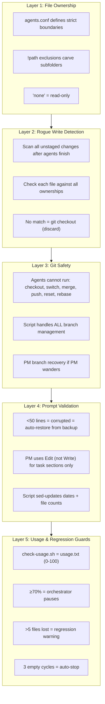

# Architecture - How the Orchestrator Works

## System Overview

## Cycle Flow

## Data Flow Between Cycles

## Agent Input Assembly

What each worker agent sees when it runs:

What PM sees (different input):

## Why Parallel Workers + PM (Not Sequential)

**Sequential:** each agent waits for the previous one, 70% of tokens are "I agree." **Parallel:** all workers run simultaneously, PM coordinates after.

## Safety Layers

## Key Design Decisions

### Script Controls Git (Not Agents)
Agents never run git commands. The script creates branches, commits by file ownership, merges to main, and pushes to origin. This eliminates race conditions and ensures clean history.

### File Ownership = No Conflicts
Each agent has explicit directory ownership in `agents.conf`. If an agent writes outside its directories, rogue detection catches it and discards the change.

### Shared Context = Cheap Communication
Instead of agents chatting with each other (expensive, slow), they read/write a shared markdown file. Backend appends "Added POST /api/users" = Frontend reads it and uses the endpoint. Cost: ~100 tokens vs ~5000 for a debate.

### PM Updates Task Sections (Not Full Rewrites)
PM uses the Edit tool to modify only "What's DONE" and "YOUR TASKS" sections. The script auto-updates timestamps and file counts via `sed`. This prevents PM from accidentally nuking tech stack or ownership sections.

### Parallel Workers, Sequential Review
Workers run simultaneously (3x faster than sequential). PM runs last as the single coordination point. This is intentionally a hub-and-spoke topology - not a mesh.

## CLAUDE.md Integration

Every project should document the orchestrator in its `CLAUDE.md` file. This is auto-loaded by Claude Code, so all agents (and manual sessions) know the system exists.

Key sections to include:
- **Quick commands** - `orchestrate`, `run`, `list`, `check-usage`
- **What the script handles** - timestamps, file counts, usage, git, rogue detection
- **What PM handles** - task sections, milestone status, session tracker, human actions
- **Monitoring** - log location, don't edit script while running

See `template/CLAUDE.md` for the full template.
